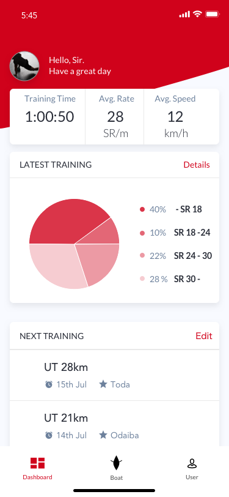
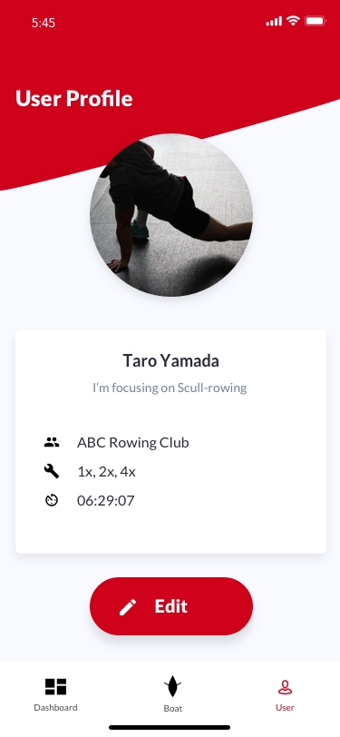

# Rowing Assistant Mobile App (React Native)

Rowing assistant mobile app with React Native

## Screenshots

<table>
  <tr>
    <td></td>
    <td></td>
    <td></td>
  <tr>
</table>

### Installation & Usage

```
- Clone
- Run `npm install` in the terminal
- Run on IOS or Android projects in emulator
```

## Tech Stacks

- react
- react-native
- react-native-chart-kit
- react-navigation
- react-redux
- Font Based Icons

## Directory Structure
```
├── assets/
│   ├── fonts/
│   ├── images/
│   ├── screenshots/
│   ├── data.js
│   ├── Icons.js
│   └── style.js
├── components/
│   ├── Filters.js
│   ├── GridItem.js
│   ├── List.js
│   └── UserItem.js
├── containers/
│   ├── Boats.js
│   ├── Dashboard.js
│   └── User.js

├── App.js
├── App.json
├── Index.js
└── README.md
```